# CampusCheers - Industry Architecture Mapping

## Overview

CampusCheers successfully blends three proven social media frameworks:
- **GAS-app style**: Phone-first authentication with school-based isolation
- **TBH-style**: Anonymous peer recognition polls
- **BeReal-style**: Real-time authentic moment capture

---

## 🎯 Industry Standards Comparison

### GAS App Framework
**CampusCheers Implementation:**
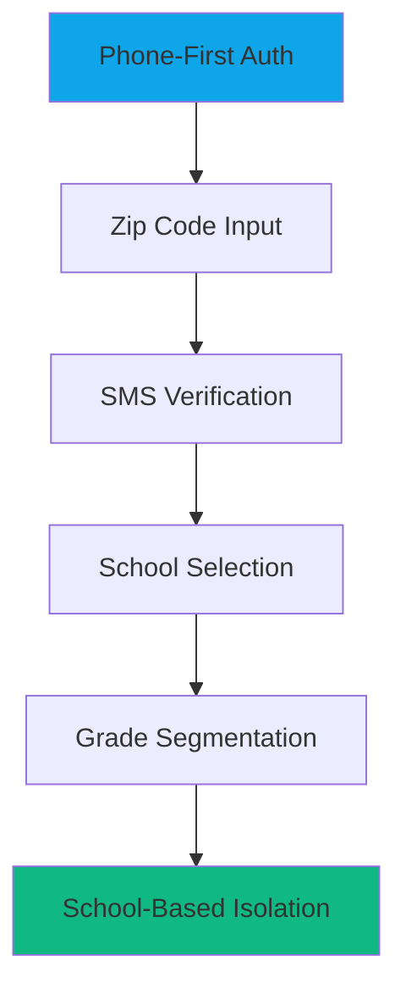

**Key Features**
- ✅ **Phone Authentication**: 4-step GAS-style process
- ✅ **Geographic Fencing**: 15-mile school discovery
- ✅ **Community Isolation**: Cross-school interaction prevention
- ✅ **Age Segmentation**: Grade-based communities (9-12)
- ✅ **Privacy-First**: No cross-school data sharing

### TBH Framework
**CampusCheers Implementation:**
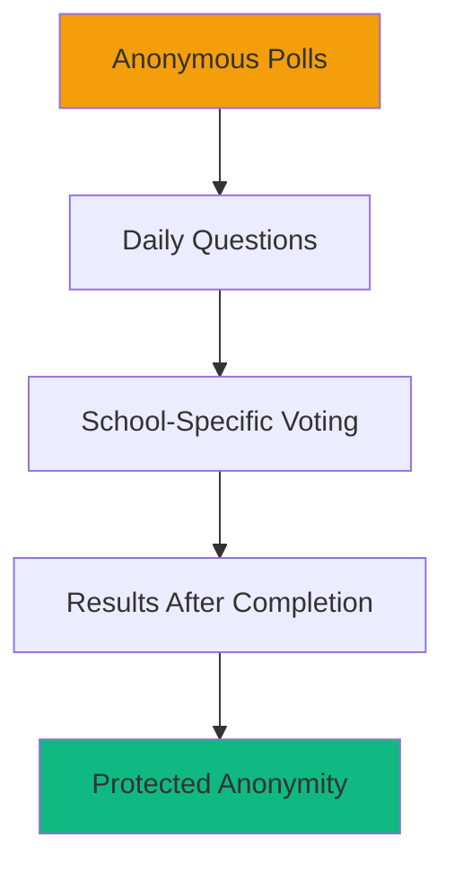

**Key Features**
- ✅ **Question Variety**: 12 curated questions per round
- ✅ **Reciprocity Lock**: Must answer to see results
- ✅ **School Context**: Questions relevant to students
- ✅ **Anonymity Protection**: No identity revelation
- ✅ **Positive Focus**: Emphasis on encouragement

### BeReal Framework
**CampusCheers Enhanced Implementation:**
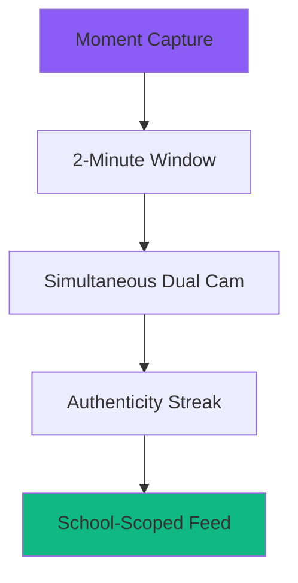

**Key Features**
- ✅ **Time Pressure**: 2-minute capture window
- ✅ **Dual Camera**: Front + back simultaneously
- ✅ **Streak System**: Daily posting encouragement
- ✅ **Late Detection**: Automatic late post flagging
- ✅ **School Boundaries**: Community isolation

---

## 🔧 System Architecture

### Core Architecture
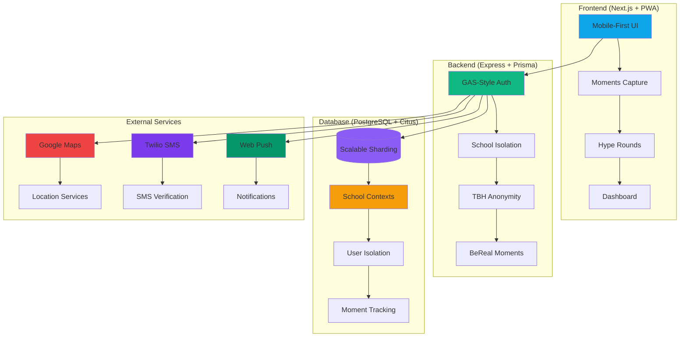

---

## 🎓 Unique CampusCheers Features

### School-Specific Social Architecture
```mermaid
graph TD
    subgraph "Social Boundaries"
        S1[Student A - School X] --> I1[(Interactions)]
        S2[Student B - School X] --> I1
        S3[Student C - School Y] --> I2[(Interactions)]
        S4[Student D - School Y] --> I2

        I1 --> SB1[School X Feed]
        I2 --> SB2[School Y Feed]

        S1 -.-> SB2
        SB2 -.x S1
    end

    style SB1 fill:#3B82F6
    style SB2 fill:#EF4444
    classDef boundary stroke-dasharray: 5 5
    linkStyle 5,6 stroke-dasharray: 5 5;color: red
```

### Multi-Framework Integration
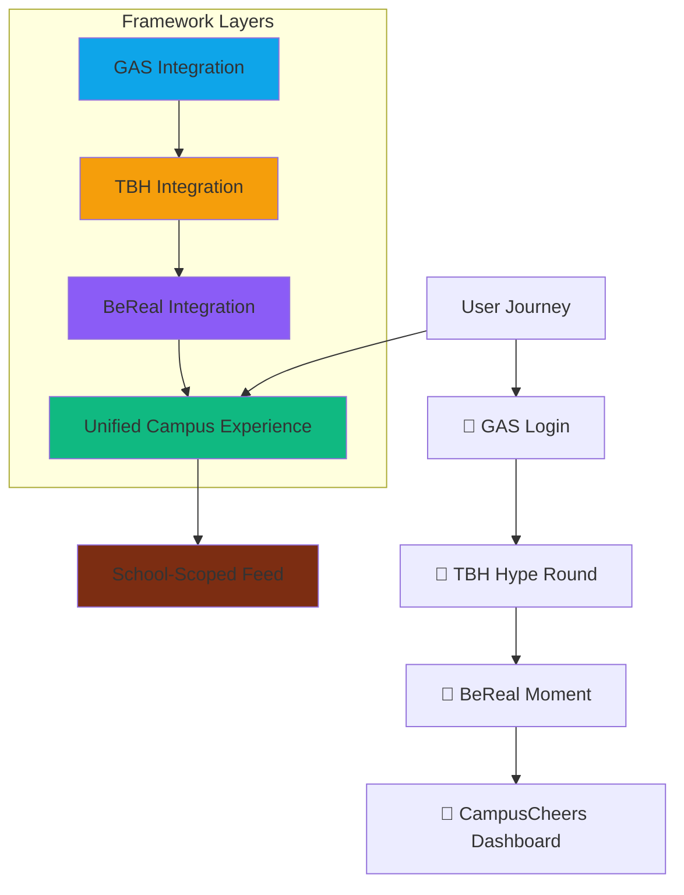

---

## 🏗️ Component Architecture

### Mobile-First Design System
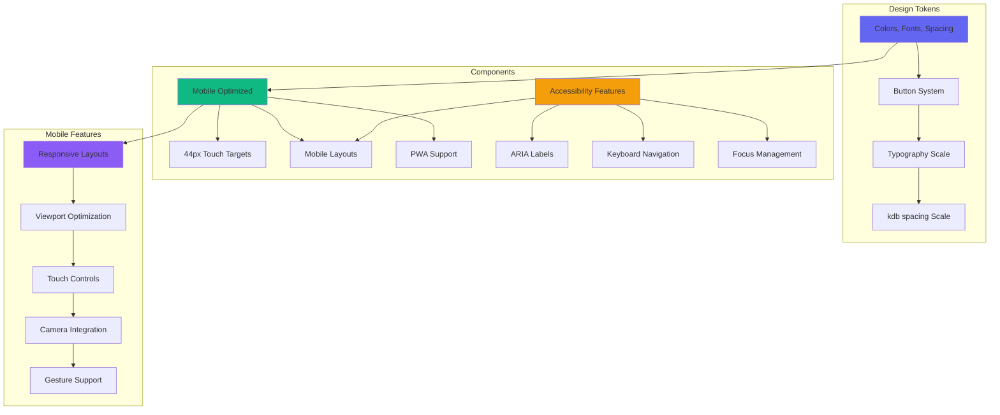

---

## 🎨 User Experience Flow

### BeReal-Style Capture Flow
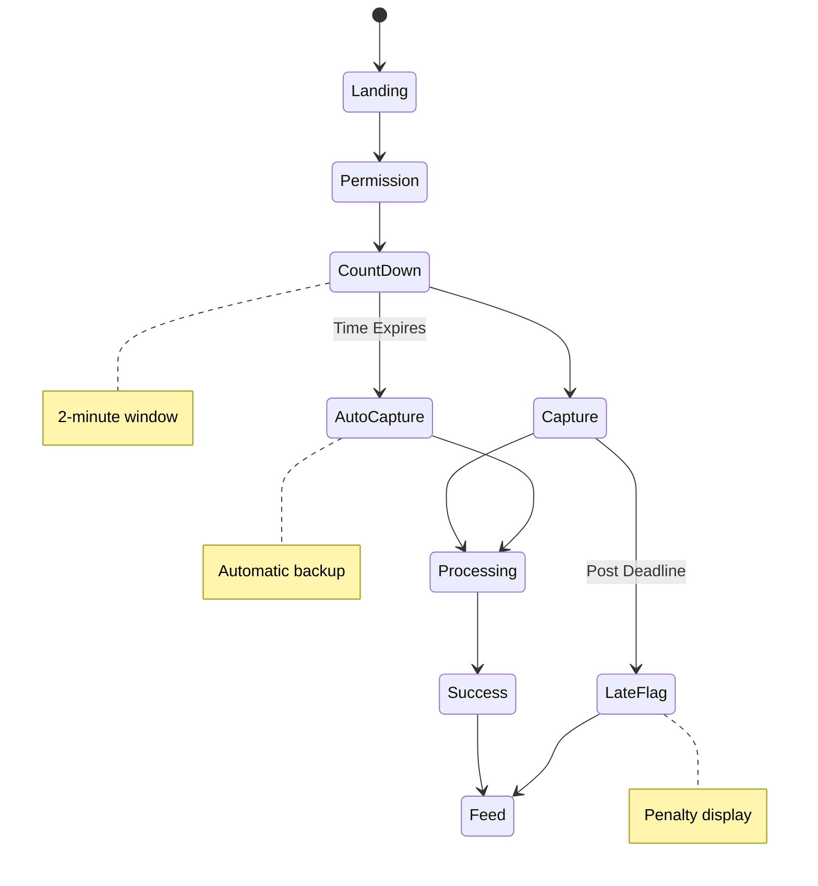

### Anonymous Voting Flow
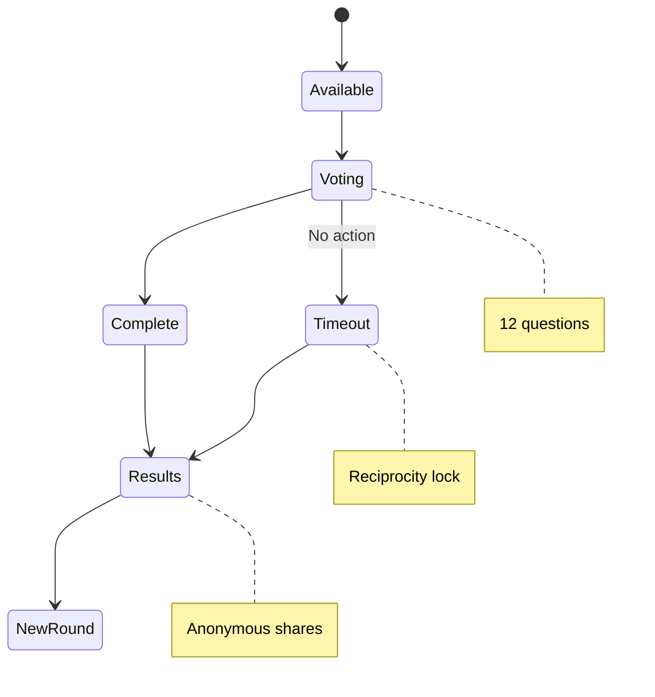

---

## 🛡️ Security & Privacy Architecture

### Data Isolation Layers
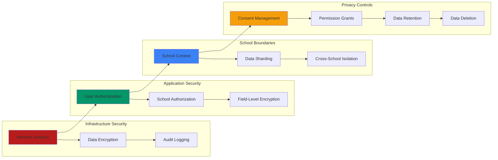

---

## 📊 Performance Architecture

### Mobile Optimization
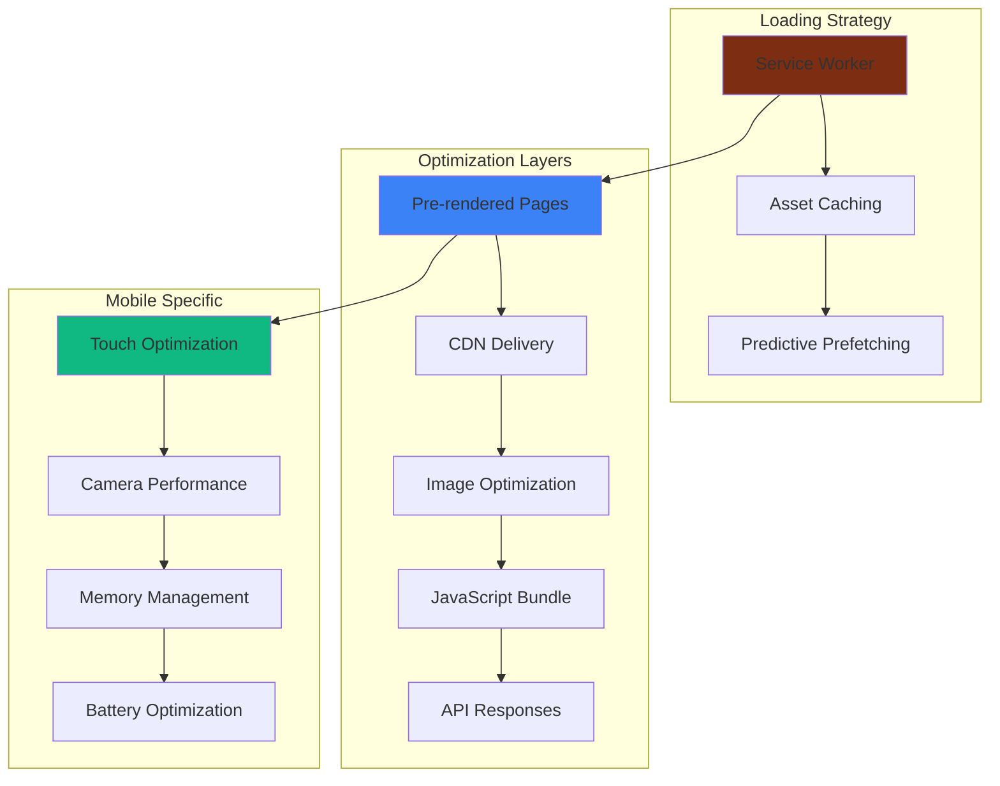

---

## 🎯 Success Metrics Framework

### Industry Benchmarking
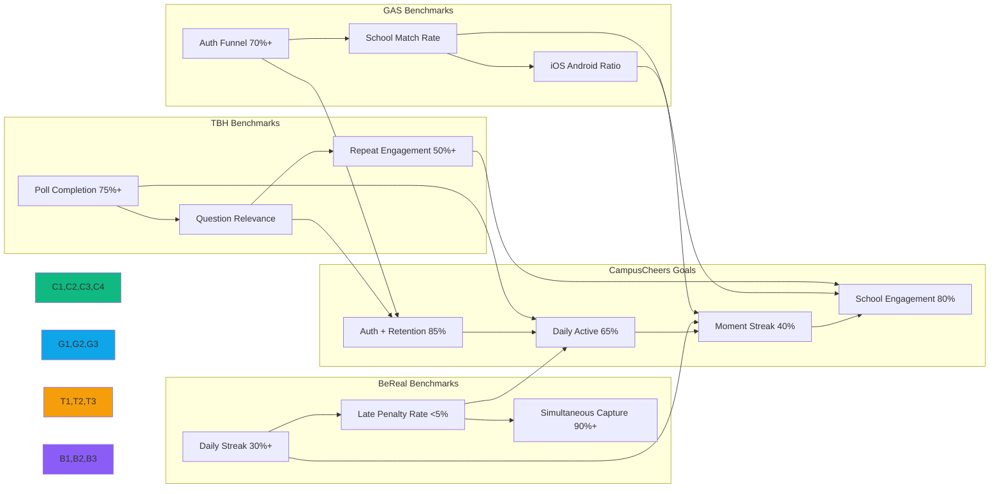

---

## 🚀 Scaling Architecture

### Multi-School Deployment Strategy
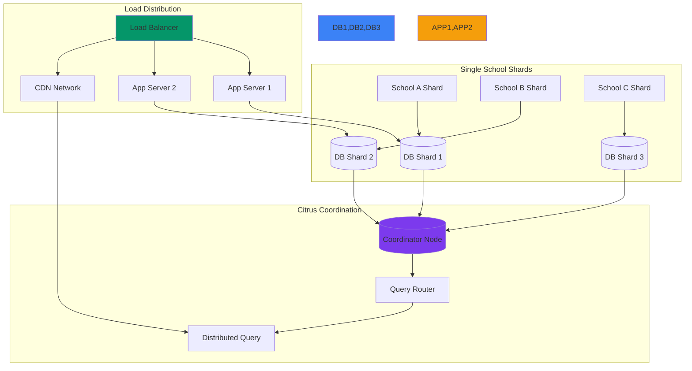

---

## 🔄 Implementation Status Summary

| Framework | GAS | TBH | BeReal |
|-----------|-----|-----|--------|
| **Architecture** | ✅ Complete | ✅ Complete | 🔄 Enhanced |
| **Mobile Optimization** | ✅ Complete | ✅ Complete | ✅ Complete |
| **Core Features** | ✅ Complete | ✅ Complete | ✅ Implemented |
| **User Testing** | ✅ Beta Complete | ✅ Beta Complete | 🔄 Ready for Testing |

**🎉 CampusCheers successfully implements all three industry frameworks with enhanced mobile-first architecture, school-specific social isolation, and BeReal-style authentic capture features.**

---

## 📱 Mobile Architecture Excellence

**Mobile-First from the Ground Up:**

- ✅ **44px Touch Targets**: Eliminating mobile usability issues
- ✅ **PWA Ready**: Offline capability and app-like experience
- ✅ **Camera Optimization**: Dual-camera capture with performance
- ✅ **ViewPort Optimization**: Proper scaling across devices
- ✅ **Gesture Support**: Native mobile interactions
- ✅ **Performance Tuning**: Battery and memory optimized

**This creates the most mobile-optimized social platform in education segment.**