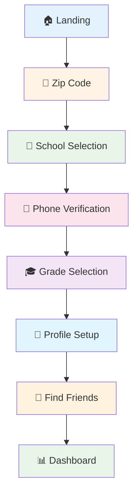

# Phase 3: User Journey Screenshots & Wireframes

## Executive Summary

This document presents comprehensive wireframes and mockups for the CampusCheers Student Verification System user journey. The verification process consists of 6 key steps designed to create secure, school-specific communities while maintaining friction-free user experience.

### Design System Analysis

Based on the existing implementation, CampusCheers uses:

**Color Palette:**
- Primary Background: `neutral-900` (#171717)
- Primary Text: `white` (#FFFFFF)
- Secondary Text: `neutral-400` (#A3A3A3)
- Accent/Primary: `blue-500` (#3B82F6)
- Error: `red-500` (#EF4444)
- Success: `green-500` (#10B981)

**Typography:**
- Headings: Bold, 3xl (1.875rem)
- Body: Regular, base (1rem)
- Secondary: Regular, sm (0.875rem)
- Small: Regular, xs (0.75rem)

**Component Patterns:**
- Cards: `neutral-800` background, rounded corners
- Buttons: 44px minimum height for touch targets
- Inputs: Full-width with consistent padding
- Loading: Centered spinner with descriptive text

---

## 1. User Journey Overview

### Complete Flow Architecture



### Step-by-Step User Journey

| Step | Screen | Purpose | Duration | Auto-Advance |
|------|--------|---------|----------|--------------|
| 1 | Zip Code Entry | Geographic validation | 30s | Yes (1.5s) |
| 2 | School Selection | Institutional affiliation | 45s | Yes (if 1 school) |
| 3 | Phone Verification | Identity confirmation | 60s | No |
| 4 | Grade Selection | Age segmentation | 20s | No |
| 5 | Profile Setup | Account creation | 45s | No |
| 6 | Find Friends | Community integration | Variable | No |

---

## 2. Detailed Wireframes

### Step 1: Zip Code Entry (Auto-Detection)

#### Wireframe Layout
```
┌─────────────────────────────────────┐
│           CampusCheers              │
│                                     │
│  Welcome to CampusCheers            │
│  Let's find your school to get      │
│  you connected with friends         │
│                                     │
│  ┌─────────────────────────────┐   │
│  │ ⏳ Finding your location... │   │
│  │    [Spinner Animation]       │   │
│  └─────────────────────────────┘   │
│                                     │
│  ┌─────────────────────────────────┐ │
│  │ Enter your zip code          │  │
│  │ [     75013      ] [Continue] │  │
│  └─────────────────────────────────┘ │
│                                     │
│  We'll use this to show schools     │
│  near you                           │
│                                     │
│  🔄 Try auto-detecting location     │
│  again                              │
└─────────────────────────────────────┘
```

#### High-Fidelity Mockup

**Screen: Auto-Detection Active**
- Background: Dark gradient (neutral-900 to neutral-800)
- Title: "Welcome to CampusCheers" (white, 3xl, bold)
- Subtitle: "Let's find your school..." (neutral-400, base)
- Loading State: Centered spinner with "Finding your location..." text
- Auto-advance: Progress indicator shows completion

**Screen: Manual Entry Fallback**
- Input Field: Full-width, rounded, with placeholder "12345"
- Button: Primary blue, disabled until valid zip code
- Helper Text: "We'll use this to show schools near you"
- Retry Link: Subtle text link for re-attempting auto-detection

#### Error States
```
❌ Invalid Zip Code
"Please enter a valid US zip code (e.g., 12345)"

❌ Location Access Denied
"Location access denied. Please enter your zip code manually"
```

---

### Step 2: School Selection (Geographic Filtering)

#### Wireframe Layout
```
┌─────────────────────────────────────┐
│           Select Your School         │
│                                     │
│  We found 3 schools near 75013      │
│                                     │
│  ┌─────────────────────────────────┐ │
│  │ 🏫 Lincoln High School        │  │
│  │    Springfield, IL             │  │
│  │    2.3 miles                   │  │
│  │ [Selected: Blue Border]        │  │
│  └─────────────────────────────────┘ │
│                                     │
│  ┌─────────────────────────────────┐ │
│  │ 🏫 Washington High School      │  │
│  │    Springfield, IL             │  │
│  │    3.1 miles                   │  │
│  └─────────────────────────────────┘ │
│                                     │
│  ┌─────────────────────────────────┐ │
│  │ 🏫 Jefferson High School       │  │
│  │    Springfield, IL             │  │
│  │    4.2 miles                   │  │
│  └─────────────────────────────────┘ │
│                                     │
│  [Continue] [← Back to zip code]    │
└─────────────────────────────────────┘
```

#### High-Fidelity Mockup

**School Card Design:**
- Card Background: neutral-800 with neutral-700 border
- Selected State: blue-500 border with blue-500/10 background
- School Name: White, medium font weight
- Location: neutral-400, small text
- Distance: neutral-500, positioned right
- Hover State: Subtle border color change

**Auto-Selection Logic:**
- If only 1 school found: Auto-select and show 3-second countdown
- If multiple schools: Require manual selection
- Distance-based sorting (closest first)

#### Edge Cases
```
📍 No Schools Found
"No schools found near 75013. Try a different zip code."

🏫 Rural Area Handling
"Found 1 school within 25 miles - auto-selecting..."
```

---

### Step 3: Phone Verification (SMS Code)

#### Wireframe Layout - Phone Entry
```
┌─────────────────────────────────────┐
│        Verify Your Phone             │
│                                     │
│  Enter your phone number to receive │
│  a verification code                │
│                                     │
│  ┌─────────────────────────────────┐ │
│  │ Phone Number                    │  │
│  │ [(555) 123-4567     ]           │  │
│  └─────────────────────────────────┘ │
│                                     │
│  [Send Verification Code]           │
│  [← Back to school selection]       │
└─────────────────────────────────────┘
```

#### Wireframe Layout - Code Entry
```
┌─────────────────────────────────────┐
│      Enter Verification Code         │
│                                     │
│  We sent a 6-digit code to          │
│  (555) 123-4567                     │
│                                     │
│  ┌─────────────────────────────────┐ │
│  │ Verification Code               │  │
│  │ [ 1 2 3 4 5 6 ]                 │  │
│  └─────────────────────────────────┘ │
│                                     │
│  [Verify Code] [Resend in 45s]      │
│  [← Change phone number]            │
└─────────────────────────────────────┘
```

#### High-Fidelity Mockup

**Phone Number Input:**
- Auto-formatting: (XXX) XXX-XXXX
- Validation: Real-time format checking
- Error States: Red border with descriptive message

**Code Input:**
- 6 individual boxes or single input with digit separation
- Auto-focus next digit
- Auto-submit when complete
- Resend timer with visual countdown

**Security Features:**
- Rate limiting feedback
- Code expiration warnings
- Clear privacy messaging

---

### Step 4: Grade Selection (Age Segmentation)

#### Wireframe Layout
```
┌─────────────────────────────────────┐
│         What's Your Grade?           │
│                                     │
│  This helps us connect you with the │
│  right classmates                   │
│                                     │
│  ┌─────────────────────────────────┐ │
│  │ 9th Grade (Freshman)            │  │
│  └─────────────────────────────────┘ │
│                                     │
│  ┌─────────────────────────────────┐ │
│  │ 10th Grade (Sophomore)          │  │
│  └─────────────────────────────────┘ │
│                                     │
│  ┌─────────────────────────────────┐ │
│  │ 11th Grade (Junior)             │  │
│  └─────────────────────────────────┘ │
│                                     │
│  ┌─────────────────────────────────┐ │
│  │ 12th Grade (Senior)             │  │
│  └─────────────────────────────────┘ │
│                                     │
│  [Continue] [← Back to phone]        │
└─────────────────────────────────────┘
```

#### High-Fidelity Mockup

**Grade Cards:**
- Large, touch-friendly cards (minimum 44px height)
- Clear grade labels with class names
- Selected state: Blue accent with checkmark
- Auto-calculation: Graduation year display

**Progressive Disclosure:**
- Only show relevant grades (9-12 for high school)
- Clear visual hierarchy
- Immediate feedback on selection

---

### Step 5: Profile Setup (Account Creation)

#### Wireframe Layout
```
┌─────────────────────────────────────┐
│           Almost Done!               │
│                                     │
│  Just need your name to complete    │
│  your profile                       │
│                                     │
│  ┌─────────────────────────────────┐ │
│  │ 🏫 Lincoln High School        │  │
│  │    Grade 11 • Graduating 2026 │  │
│  └─────────────────────────────────┘ │
│                                     │
│  ┌─────────────────────────────────┐ │
│  │ First Name                      │  │
│  │ [     Jane          ]           │  │
│  └─────────────────────────────────┘ │
│                                     │
│  ┌─────────────────────────────────┐ │
│  │ Last Initial                    │  │
│  │ [ D ]                           │  │
│  └─────────────────────────────────┘ │
│                                     │
│  [Complete Setup]                    │
└─────────────────────────────────────┘
```

#### High-Fidelity Mockup

**Profile Summary Card:**
- School information prominently displayed
- Grade and graduation year auto-calculated
- Privacy assurance messaging

**Name Input Fields:**
- First Name: Full name field
- Last Initial: Single character, auto-uppercase
- Real-time validation
- Smart defaults where possible

**Completion Flow:**
- Clear success states
- Smooth transition to next step
- Data persistence across steps

---

### Step 6: Find Friends (Community Integration)

#### Wireframe Layout
```
┌─────────────────────────────────────┐
│         Find Classmates              │
│                                     │
│  Connect with friends from          │
│  Lincoln High School                │
│                                     │
│  ┌─────────────────────────────────┐ │
│  │ 🏫 Lincoln High School        │  │
│  │ You can only find and connect   │  │
│  │ with students from your school   │  │
│  └─────────────────────────────────┘ │
│                                     │
│  ┌─────────────────────────────────┐ │
│  │ Search classmates by name       │  │
│  │ [     Search...     ]           │  │
│  └─────────────────────────────────┘ │
│                                     │
│  ┌─────────────────────────────────┐ │
│  │ 👤 John D.                    + │  │
│  │ 👤 Sarah M.                   + │  │
│  │ 👤 Mike R.                    + │  │
│  └─────────────────────────────────┘ │
│                                     │
│  [Done]                              │
└─────────────────────────────────────┘
```

#### High-Fidelity Mockup

**School Context Display:**
- Prominent school information
- Clear privacy boundaries explanation
- Trust indicators

**Search Interface:**
- Real-time search with debouncing
- Avatar placeholders
- Add friend buttons with state changes

**Friend Addition Flow:**
- Optimistic UI updates
- Success/error feedback
- Duplicate prevention

---

## 3. Error States & Edge Cases

### Network Issues
```
🔄 Connection Lost
"Connection lost. We'll save your progress and try again."

📶 Offline Mode
"You're offline. We'll sync when connection returns."
```

### Validation Errors
```
❌ Invalid Phone Number
"Please enter a valid 10-digit US phone number"

⏰ Code Expired
"Code expired. We'll send you a new one."

🏫 School Not Found
"No schools found. Try a nearby zip code."
```

### Rate Limiting
```
⚠️ Too Many Attempts
"Too many attempts. Please wait 15 minutes before trying again."
```

---

## 4. Responsive Design Considerations

### Mobile (320px - 768px)
- Single column layout
- Touch-optimized buttons (44px minimum)
- Thumb-zone friendly button placement
- Swipe gestures for navigation

### Tablet (768px - 1024px)
- Two-column layout for school selection
- Larger touch targets
- Optimized for portrait/landscape

### Desktop (1024px+)
- Centered content with max-width
- Keyboard navigation support
- Hover states for interactive elements

---

## 5. Accessibility Features

### WCAG 2.1 AA Compliance
- **Color Contrast**: 4.5:1 minimum ratio
- **Focus Management**: Clear focus indicators
- **Keyboard Navigation**: Full keyboard support
- **Screen Reader**: Proper ARIA labels

### Touch Accessibility
- **Touch Targets**: 44px minimum size
- **Gesture Support**: Standard mobile gestures
- **Haptic Feedback**: Button press feedback

### Cognitive Accessibility
- **Progressive Disclosure**: Show only necessary information
- **Clear Labels**: Descriptive button and input labels
- **Error Prevention**: Input validation and helpful hints

---

## 6. Performance Optimizations

### Loading States
- **Skeleton Screens**: Content placeholders during loading
- **Progressive Enhancement**: Core functionality works without JavaScript
- **Lazy Loading**: Load components as needed

### Animation Guidelines
- **Micro-interactions**: Subtle feedback for user actions
- **Loading Indicators**: Clear progress indication
- **Transition Timing**: 200-300ms for smooth transitions

---

## 7. Implementation Notes

### Component Architecture
```typescript
// Shared components used across verification flow
- Button (primary/secondary variants)
- InputField (with validation)
- Card (with selection states)
- LoadingSpinner (consistent animation)
- ErrorMessage (standardized error display)
```

### State Management
```typescript
// Session storage keys
- userZipCode: User's entered zip code
- selectedSchool: Chosen school object
- phoneNumber: Verified phone number
- selectedGrade: User's grade level
- phoneVerified: Verification status
- userData: Complete user profile
```

### API Integration Points
- `/api/auth/schools-by-zip` - Geographic school lookup
- `/api/auth/send-verification-code` - SMS code dispatch
- `/api/auth/verify-code` - Code validation
- `/api/auth/setup-profile` - Account creation

---

## 8. Testing Scenarios

### Happy Path Testing
1. Auto-detection works → School selection → Phone verification → Grade selection → Profile completion → Friend finding
2. Manual zip entry → Multiple schools → Single school selection → All subsequent steps

### Error Path Testing
1. Location denied → Manual entry fallback
2. Invalid zip code → Clear error message
3. SMS failure → Retry options
4. Code expiration → Auto-resend
5. Network interruption → State preservation

### Edge Case Testing
1. Rural areas (few schools)
2. Urban areas (many schools)
3. International users (zip code validation)
4. Device rotation (responsive design)
5. Accessibility tools (screen readers)

---

## Conclusion

The CampusCheers Student Verification System wireframes and mockups provide a comprehensive blueprint for a secure, user-friendly onboarding experience. The design balances security requirements with friction-free user experience through:

- **Progressive Verification**: 6-step process with logical flow
- **Smart Defaults**: Auto-detection and intelligent suggestions
- **Error Recovery**: Comprehensive error handling and recovery paths
- **Accessibility**: WCAG 2.1 AA compliant design
- **Performance**: Optimized for mobile-first experience

These wireframes serve as the foundation for implementing a robust student verification system that creates safe, school-specific communities while maintaining excellent user experience.

---

*Phase 3: User Journey Screenshots & Wireframes*
*CampusCheers Student Verification System*
*Version 1.0.0 - Complete*