# CampusCheers Student Verification User Journey Flow

```mermaid
stateDiagram-v2
    [*] --> LandingPage
    LandingPage --> ZipCodeEntry: User clicks signup

    state "Step 1: Location Discovery" as ZipCodeEntry {
        [*] --> AutoDetectLocation
        AutoDetectLocation --> LocationSuccess: GPS successful
        AutoDetectLocation --> ManualEntry: GPS denied/failed
        ManualEntry --> ValidateZipCode
        LocationSuccess --> ValidateZipCode
        ValidateZipCode --> ZipCodeValid: Valid zip code
        ValidateZipCode --> ZipCodeInvalid: Invalid zip code
        ZipCodeInvalid --> ManualEntry
    }

    ZipCodeEntry --> SchoolSelection: Zip code validated

    state "Step 2: School Selection" as SchoolSelection {
        [*] --> FetchSchools
        FetchSchools --> MultipleSchools: 2+ schools found
        FetchSchools --> SingleSchool: 1 school found
        FetchSchools --> NoSchools: 0 schools found

        MultipleSchools --> SelectSchool
        SingleSchool --> AutoSelectSchool
        NoSchools --> ShowError

        SelectSchool --> SchoolSelected
        AutoSelectSchool --> SchoolSelected
        ShowError --> BackToZipCode
        BackToZipCode --> ZipCodeEntry
    }

    SchoolSelection --> PhoneVerification: School selected

    state "Step 3: Phone Verification" as PhoneVerification {
        [*] --> EnterPhoneNumber
        EnterPhoneNumber --> ValidatePhone
        ValidatePhone --> PhoneValid: Valid format
        ValidatePhone --> PhoneInvalid: Invalid format
        PhoneInvalid --> EnterPhoneNumber

        PhoneValid --> SendSMSCode
        SendSMSCode --> CodeSent: SMS delivered
        SendSMSCode --> CodeFailed: SMS failed
        CodeFailed --> RetrySend

        CodeSent --> EnterVerificationCode
        EnterVerificationCode --> ValidateCode
        ValidateCode --> CodeValid: Code correct
        ValidateCode --> CodeInvalid: Code incorrect
        ValidateCode --> CodeExpired: Code expired

        CodeInvalid --> EnterVerificationCode
        CodeExpired --> SendSMSCode
        RetrySend --> SendSMSCode
    }

    PhoneVerification --> GradeSelection: Phone verified

    state "Step 4: Grade Selection" as GradeSelection {
        [*] --> ShowGradeOptions
        ShowGradeOptions --> SelectGrade
        SelectGrade --> GradeSelected
    }

    GradeSelection --> ProfileSetup: Grade selected

    state "Step 5: Profile Setup" as ProfileSetup {
        [*] --> EnterName
        EnterName --> ValidateName
        ValidateName --> NameValid: Valid name
        ValidateName --> NameInvalid: Invalid name
        NameInvalid --> EnterName

        NameValid --> CreateProfile
        CreateProfile --> ProfileSuccess: Profile created
        CreateProfile --> ProfileFailed: Creation failed
        ProfileFailed --> EnterName
    }

    ProfileSetup --> FindFriends: Profile created

    state "Step 6: Community Integration" as FindFriends {
        [*] --> ShowSchoolContext
        ShowSchoolContext --> SearchFriends
        SearchFriends --> ShowResults
        ShowResults --> AddFriends
        AddFriends --> FriendsAdded
        FriendsAdded --> CompleteOnboarding
    }

    FindFriends --> Dashboard: Onboarding complete

    Dashboard --> [*]

    %% Error states and recovery paths
    state "Error Recovery" as ErrorRecovery {
        [*] --> NetworkError
        [*] --> ValidationError
        [*] --> TimeoutError

        NetworkError --> RetryAction
        ValidationError --> ShowHelp
        TimeoutError --> RestartFlow

        RetryAction --> [*]
        ShowHelp --> [*]
        RestartFlow --> [*]
    }

    %% Styling
    classDef stepClass fill:#e1f5fe,stroke:#01579b,stroke-width:2px
    classDef errorClass fill:#ffebee,stroke:#c62828,stroke-width:2px
    classDef successClass fill:#e8f5e8,stroke:#2e7d32,stroke-width:2px

    class ZipCodeEntry,SchoolSelection,PhoneVerification,GradeSelection,ProfileSetup,FindFriends stepClass
    class ErrorRecovery errorClass
    class Dashboard successClass
```

## Detailed Flow Annotations

### Step 1: Location Discovery (30 seconds)
**Purpose**: Geographic validation and school proximity filtering
**Auto-advance**: Yes (1.5s after successful auto-detection)
**Fallback**: Manual zip code entry with real-time validation
**Error Handling**: Clear messaging for invalid zip codes

### Step 2: School Selection (45 seconds)
**Purpose**: Institutional affiliation and community boundaries
**Auto-advance**: Yes (if only 1 school found within radius)
**Logic**: Geographic proximity (15-mile radius), sorted by distance
**Edge Cases**: Rural areas, multiple schools, no schools found

### Step 3: Phone Verification (60 seconds)
**Purpose**: Identity verification and fraud prevention
**Security**: 6-digit codes, 10-minute expiration, rate limiting
**UX**: Auto-formatting, resend timer, clear error messages
**Recovery**: Multiple retry attempts with cooldown periods

### Step 4: Grade Selection (20 seconds)
**Purpose**: Age-appropriate community segmentation
**Options**: 9th-12th grade with class names (Freshman-Senior)
**Logic**: Auto-calculation of graduation year
**Validation**: Required selection before proceeding

### Step 5: Profile Setup (45 seconds)
**Purpose**: Account creation with minimal required information
**Fields**: First name + last initial for privacy
**Context**: Pre-filled school and grade information
**Validation**: Real-time input validation

### Step 6: Find Friends (Variable)
**Purpose**: Community integration and initial connections
**Features**: School-specific search, friend requests
**Privacy**: Clear boundaries explanation
**Completion**: Optional step, can proceed to dashboard

## Error States & Recovery

### Network Issues
- **Connection Lost**: State preservation, automatic retry
- **API Timeout**: Exponential backoff, user notification
- **Offline Mode**: Queue actions, sync on reconnection

### Validation Errors
- **Invalid Zip Code**: Format hints, nearby suggestions
- **Phone Number Issues**: Formatting help, carrier warnings
- **Code Expiration**: Automatic resend, clear messaging

### Security Limits
- **Rate Limiting**: Clear wait times, progressive delays
- **Account Locks**: Temporary blocks with appeal process
- **Suspicious Activity**: Pattern detection with user education

## Performance Metrics

| Step | Target Time | Success Rate | Drop-off Rate |
|------|-------------|--------------|---------------|
| Zip Code | < 30s | > 95% | < 2% |
| School Selection | < 45s | > 92% | < 3% |
| Phone Verification | < 60s | > 90% | < 5% |
| Grade Selection | < 20s | > 98% | < 1% |
| Profile Setup | < 45s | > 95% | < 2% |
| Find Friends | Variable | > 85% | < 10% |

## Accessibility Considerations

### Keyboard Navigation
- Tab order follows logical reading flow
- Enter/Space activates interactive elements
- Escape cancels operations
- Arrow keys navigate selections

### Screen Reader Support
- Semantic HTML structure
- ARIA labels and descriptions
- Live regions for dynamic content
- Clear heading hierarchy

### Touch Accessibility
- 44px minimum touch targets
- Gesture support for common actions
- Haptic feedback for interactions
- Thumb-zone optimized layouts

## Mobile Responsiveness

### Breakpoints
- **Mobile**: 320px - 768px (single column, touch-optimized)
- **Tablet**: 768px - 1024px (optimized cards, landscape support)
- **Desktop**: 1024px+ (centered layout, keyboard shortcuts)

### Touch Patterns
- Swipe to navigate between steps
- Long press for additional options
- Pinch to zoom on maps/images
- Double tap for quick actions

This flow diagram provides a comprehensive overview of the user journey, including all success paths, error states, and recovery mechanisms. The design ensures a secure, user-friendly experience that balances verification requirements with seamless onboarding.